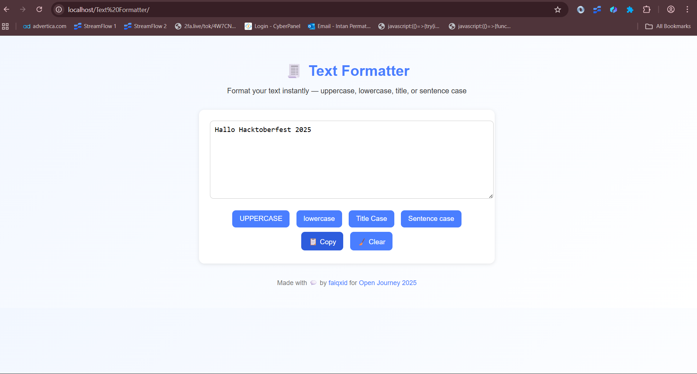

# 🧾 Text Formatter

> A simple browser-based tool to instantly format your text into uppercase, lowercase, title case, or sentence case — built for **#Hacktoberfest2025**

---

## ✨ About
Text Formatter is a small, useful tool that helps writers, developers, and students quickly change the capitalization style of any text.  
Runs fully offline in your browser — no installation required.

---

## 📸 Preview


---

## ⚙️ Features
- Convert to **UPPERCASE**, **lowercase**, **Title Case**, or **Sentence case**
- One-click **Copy** and **Clear**
- Responsive UI design
- 100% offline — just open in your browser!

---

## 🚀 How to Run
1. Open `index.html` directly in your browser, or
2. Run a local server:
   ```bash
   python3 -m http.server 8000
