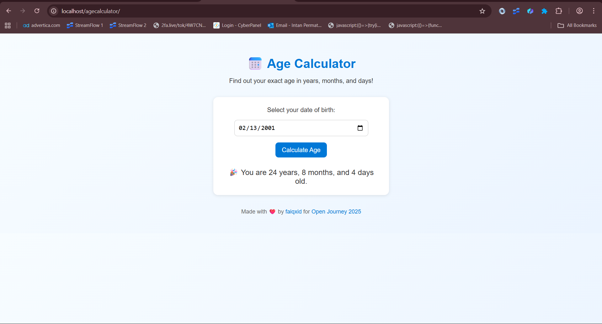

# 📅 Age Calculator

> A simple browser-based age calculator built with HTML, CSS, and JavaScript — for **#Hacktoberfest2025**

---

## ✨ About
This project calculates a person's exact age in years, months, and days based on their date of birth.  
It’s lightweight, runs offline, and is designed with a clean and responsive interface.

---

## 📸 Preview


---

## ⚙️ Features
- Calculate exact age in **years, months, and days**
- Simple, clean, and responsive UI
- Runs fully offline — just open `index.html`
- Perfect example for beginners joining Hacktoberfest

---

## 🚀 How to Run
1. Open `index.html` directly in your browser, or
   ```bash
   python3 -m http.server 8000
