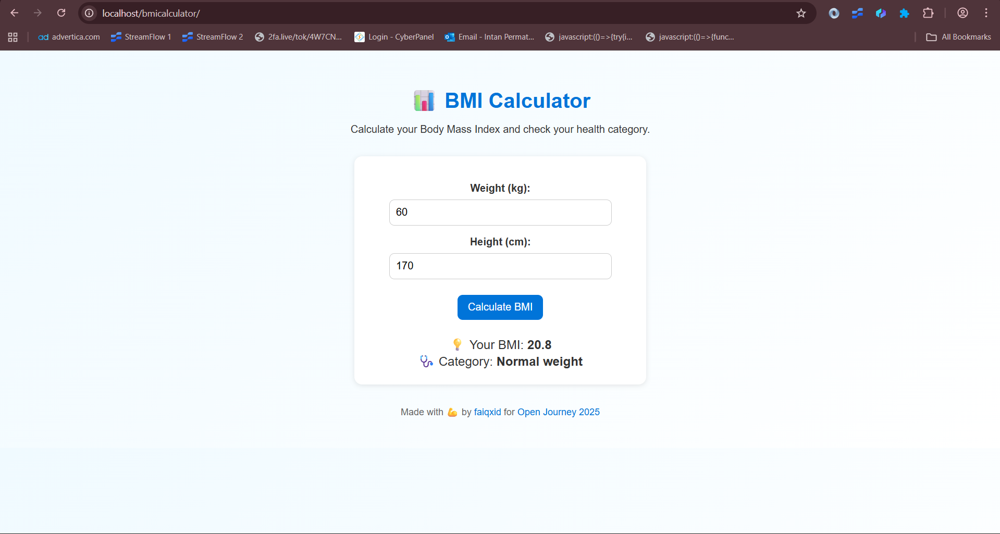

# 📊 BMI Calculator

> A simple Body Mass Index calculator built with HTML, CSS, and JavaScript — for **#Hacktoberfest2025**

---

## ✨ About
BMI Calculator helps users check their body mass index and understand whether their weight is within a healthy range.  
This project runs offline and has a clean, mobile-friendly UI.

---

## 📸 Preview


---

## ⚙️ Features
- Calculate **Body Mass Index (BMI)** instantly  
- Determine health category (Underweight / Normal / Overweight / Obese)  
- Responsive UI with clean design  
- 100% offline, no external libraries  

---

## 🚀 How to Run
1. Open `index.html` directly in your browser, or
   ```bash
   python3 -m http.server 8000

