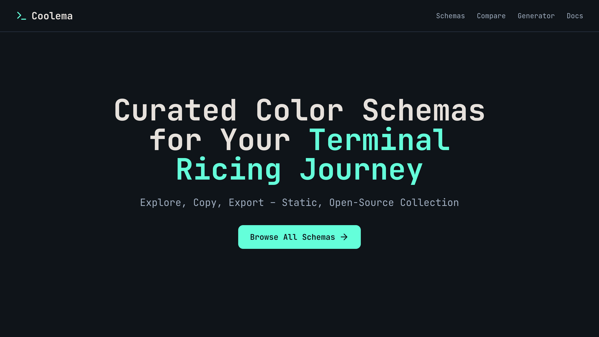
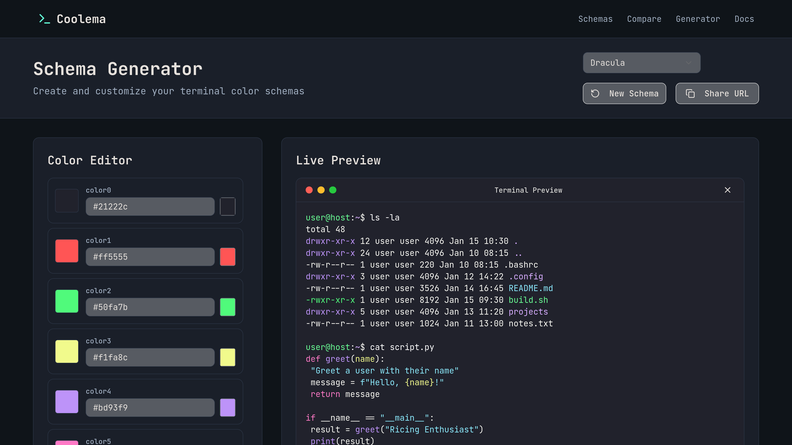
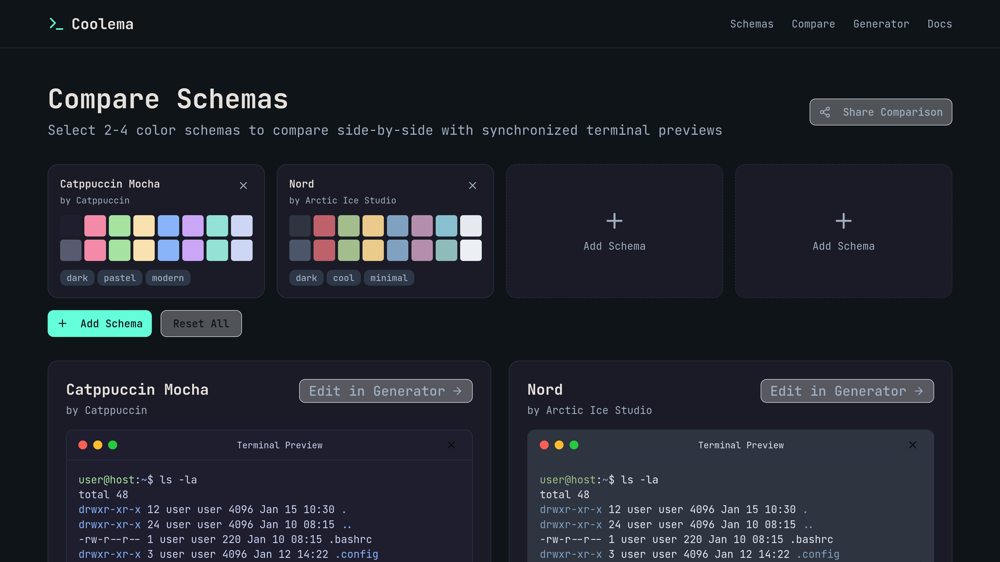

## 🎯 Project Information
### Project Title
**Coolema**
### 👤 Contributor
- **Name**: Aditya Rahmad
- **GitHub**: [@AdityaZxxx](https://github.com/AdityaZxxx)
- **Contact**: [Twitter](https://twitter.com/adxxya30)
---

## 📖 Description
Coolema is a static, open-source collection of curated color schemas for terminal theming and ricing enthusiasts. Inspired by popular themes like Gruvbox and Tokyo Night, it provides an interactive gallery where users can browse, preview, edit, and export schemas to popular terminal emulators like Kitty, Alacritty, and more.

- **What problem does it solve?**  
  Terminal ricing can be time-consuming—finding, customizing, and applying color schemas across tools often involves scattered resources and manual config tweaks. Coolema centralizes everything in one place, with real-time previews and one-click exports to reduce setup friction.

- **Who is it for?**  
  Linux ricers, developers on Arch/Hyprland setups, and anyone customizing terminals (e.g., via Neovim or VSCode integrations). Perfect for beginners overwhelmed by options and pros seeking quick comparisons.

- **What makes it unique or interesting?**  
  Fully static (no DB, MDX-powered), with interactive tools like a schema generator and side-by-side comparator that feel native. Built as a personal portfolio project, it's contribution-friendly for Hacktoberfest—add your own schema via the built-in editor!

**Example Usage:**  
> Load a base schema like Gruvbox Dark, tweak the accent colors with HSL sliders, preview in a simulated terminal, then export a Kitty YAML config. Share your custom via URL and submit a PR!

---

## 🛠️ Tech Stack / Tools
- **Frontend**: Next.js 15+ (App Router), Tailwind CSS, shadcn/ui components, MDX for content
- **State & Utils**: React Hook Form, Chroma.js (for color manipulation), TypeScript
- **Deployment**: Vercel (static export)

---

## 🔗 Links
### 🌐 Live Demo
[View Live Project](https://coolema.vercel.app)
### 📂 Repository
[GitHub Repository](https://github.com/AdityaZxxx/coolema)

---

## 📸 Screenshots / Preview
### Landing Page
  
_Minimalist dark-mode hero with featured schemas and ricing-inspired design_

### Schemas Page
  
_Browsable grid of color schemas with filters, previews, and quick-copy options_

### Generator Tool
  
_Real-time color editor with TerminalPreview and export dropdowns_

### Comparison Tool
  
_Side-by-side previews for easy schema diffs_

---

## ✨ Key Features
1. **Schema Gallery**: Browse curated themes (Gruvbox, Nord, etc.) with grid previews, tags, and search
2. **Detail Viewer**: Interactive 4x4 palette with copyable hex/RGB, terminal mockup, and multi-format exports (Kitty YAML, Alacritty TOML, etc.)
3. **Schema Generator**: Load/tweak schemas with color pickers, HSL sliders, and real-time TerminalPreview—export to JSON/MDX for contributions
4. **Side-by-Side Comparator**: Select 2-4 schemas for synchronized previews and color diff tables
5. **Open-Source Ready**: Docs with contribution guide; generate PR-ready MDX snippets
6. **Performance & UX**: Static site, shareable URLs, dark-mode by default, mobile-responsive

---

## 🎓 What I Learned
Lessons learned while building this project:
- Mastering MDX for static content management—frontmatter for schemas made data handling seamless without a DB
- Building interactive UIs with Next.js: Dynamic CSS vars for theme previews and URL state for shareability improved my React skills
- Color theory in code: Integrating Chroma.js taught me HSL manipulation and harmony checks for better UX
- Open-source best practices: Setting up contribution templates and validation scripts boosted my GitHub workflow
- Overall, honed problem-solving for ricing pains I face daily on Arch Linux with Hyprland

---

## 🔮 Future Improvements
Some ideas to add or improve in the future:
- [ ] More terminal formats (iTerm2, Konsole, GNOME Terminal)
- [ ] Advanced color harmony analyzer with WCAG contrast checks
- [ ] Community ratings, favorites, and user-submitted schemas via GitHub forms
- [ ] Integrations: VSCode/Neovim theme exports, wallpaper generators from palettes
- [ ] Analytics: Track popular schemas for better curation

---

## 📜 License
[MIT](LICENSE)

---

## 🙏 Acknowledgments
- Thanks to the Reddit r/unixporn community for endless ricing inspiration
- Shoutout to shadcn/ui and Next.js docs for speeding up development
- Built as part of my personal learning journey toward full-stack dev

---

**⭐ If you like this project, consider giving it a star on GitHub!** 