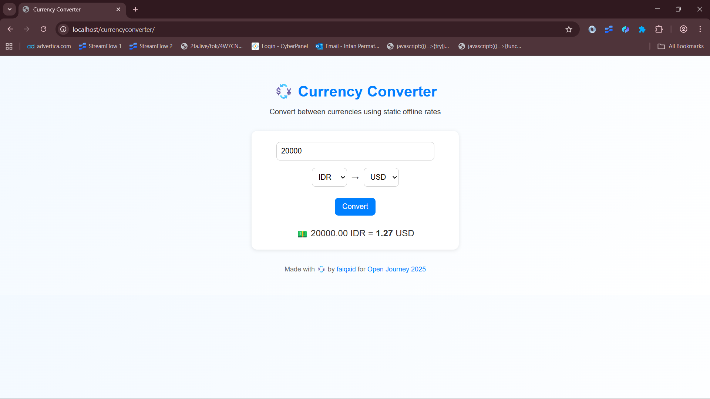

# 💱 Currency Converter

> A simple offline currency converter built with HTML, CSS, and JavaScript — for **#Hacktoberfest2025**

---

## ✨ About
This project lets you convert between popular currencies using pre-defined static rates.  
It runs fully offline and is perfect for quick conversion demos or educational use.

---

## 📸 Preview


---

## ⚙️ Features
- Convert between **USD, EUR, IDR, JPY, GBP**
- Instant conversion without API or internet
- Responsive and mobile-friendly design
- Fully open source and beginner-friendly

---

## 🚀 How to Run
1. Open `index.html` directly in your browser, or
   ```bash
   python3 -m http.server 8000
