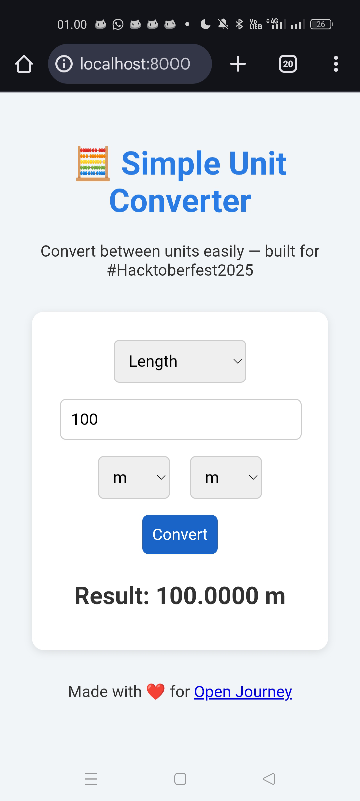

# 🧮 Simple Unit Converter

> A lightweight, browser-based unit converter built for **#Hacktoberfest2025**  
> Made with ❤️ for [Open Journey](https://github.com/faiqxid/open-journey)

---

## 📸 Preview



---

## ✨ About

**Simple Unit Converter** is a tiny yet practical web tool that lets you quickly convert between common units — right from your browser, no installation needed.

Built with pure **HTML**, **CSS**, and **JavaScript**, this project demonstrates how a simple idea can still be useful and beginner-friendly for open source collaboration.

---

## ⚙️ Features

✅ Convert **Length**, **Weight**, and **Temperature** units  
✅ Fully responsive design — works on both mobile & desktop  
✅ No external libraries or dependencies  
✅ Instant calculation with clean UI  
✅ Perfect for beginners joining **Hacktoberfest 2025**

---

## 📚 Supported Units

### 📏 Length
- meter (m), centimeter (cm), kilometer (km), inch (inch), foot (ft)

### ⚖️ Weight
- kilogram (kg), gram (g), pound (lb), ounce (oz)

### 🌡 Temperature
- Celsius (°C), Fahrenheit (°F), Kelvin (K)

---

## 🚀 How to Run

You can open the project **directly in your browser** or serve it locally:

### Option 1 — Open directly
Just open `index.html` in your browser.

### Option 2 — Run local server (Termux / PC)
```bash
cd showcase/2025/unitconvert
python3 -m http.server 8000
